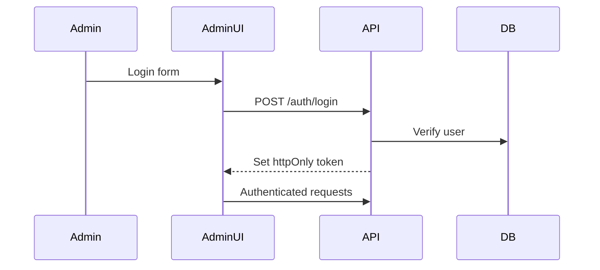

# Auth Flow (Mermaid)

```mermaid
sequenceDiagram
  participant Admin
  participant AdminUI
  participant API
  participant DB

  Admin->>AdminUI: Login form
  AdminUI->>API: POST /auth/login
  API->>DB: Verify user
  API-->>AdminUI: Set httpOnly token
  AdminUI->>API: Authenticated requests
```
