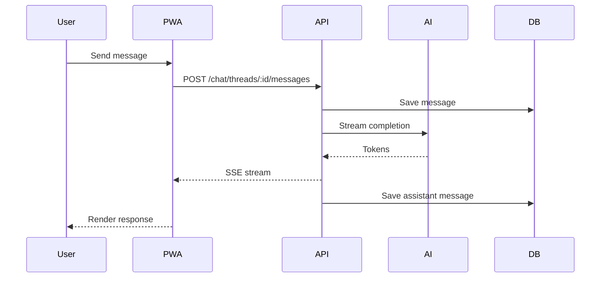

# Chat Flow (Mermaid)

```mermaid
sequenceDiagram
  participant User
  participant PWA
  participant API
  participant AI
  participant DB

  User->>PWA: Send message
  PWA->>API: POST /chat/threads/:id/messages
  API->>DB: Save message
  API->>AI: Stream completion
  AI-->>API: Tokens
  API-->>PWA: SSE stream
  API->>DB: Save assistant message
  PWA-->>User: Render response
```
