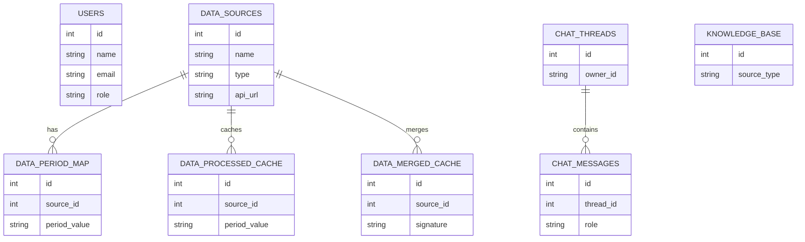

# Database ERD (Mermaid)

```mermaid
erDiagram
  USERS {
    int id
    string name
    string email
    string role
  }
  DATA_SOURCES {
    int id
    string name
    string type
    string api_url
  }
  DATA_PERIOD_MAP {
    int id
    int source_id
    string period_value
  }
  DATA_PROCESSED_CACHE {
    int id
    int source_id
    string period_value
  }
  DATA_MERGED_CACHE {
    int id
    int source_id
    string signature
  }
  CHAT_THREADS {
    int id
    string owner_id
  }
  CHAT_MESSAGES {
    int id
    int thread_id
    string role
  }
  KNOWLEDGE_BASE {
    int id
    string source_type
  }

  DATA_SOURCES ||--o{ DATA_PERIOD_MAP : has
  DATA_SOURCES ||--o{ DATA_PROCESSED_CACHE : caches
  DATA_SOURCES ||--o{ DATA_MERGED_CACHE : merges
  CHAT_THREADS ||--o{ CHAT_MESSAGES : contains
```
