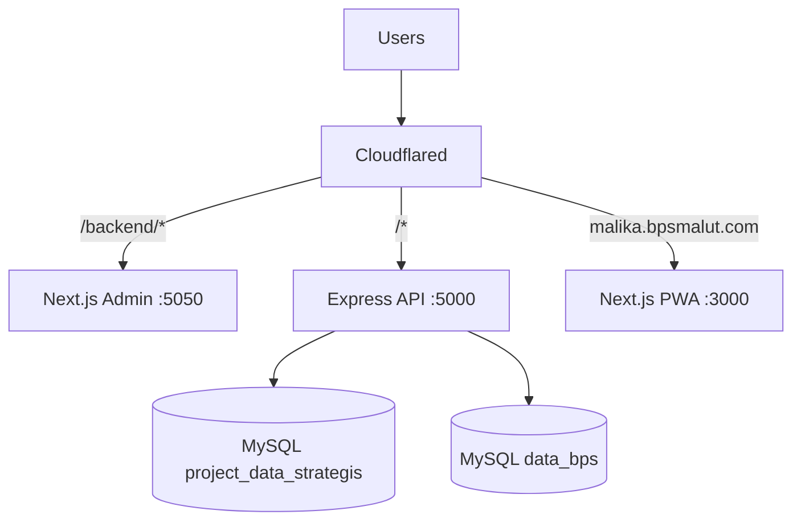

# Deployment Topology (Mermaid)

```mermaid
flowchart TB
  Client[Users] --> Cloudflared
  Cloudflared -->|/backend/*| Admin[Next.js Admin :5050]
  Cloudflared -->|/*| API[Express API :5000]
  Cloudflared -->|malika.bpsmalut.com| PWA[Next.js PWA :3000]
  API --> DB[(MySQL project_data_strategis)]
  API --> Replica[(MySQL data_bps)]
```
