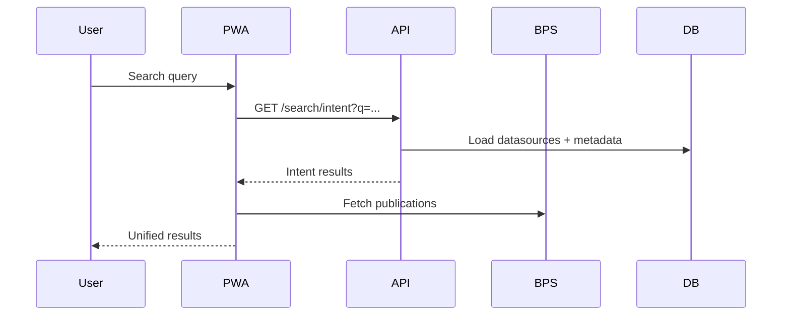

# Search Flow (Mermaid)

```mermaid
sequenceDiagram
  participant User
  participant PWA
  participant API
  participant BPS
  participant DB

  User->>PWA: Search query
  PWA->>API: GET /search/intent?q=...
  API->>DB: Load datasources + metadata
  API-->>PWA: Intent results
  PWA->>BPS: Fetch publications
  PWA-->>User: Unified results
```
